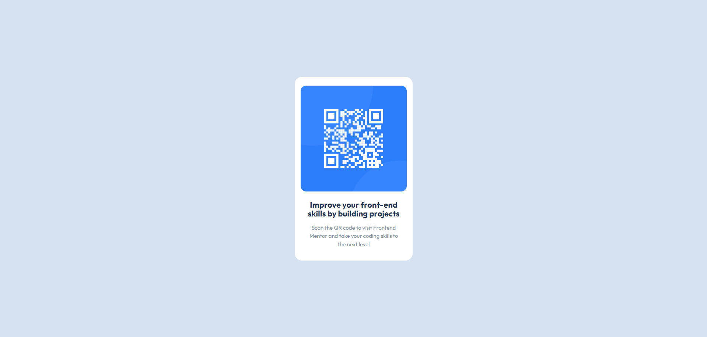

# Frontend Mentor - QR code component solution

This is a solution to the <a href="https://www.frontendmentor.io/challenges/qr-code-component-iux_sIO_H" target="_blank">
QR code component challenge on Frontend Mentor</a>

## Table of contents

- [Overview](#overview) 
  - [Screenshot](#screenshot) 
  - [Links](#links) 
- [My process](#my-process)
  - [Built with](#built-with) 
  - [What I learned](#what-i-learned)
  - [Continued development](#continued-development)
  - [Useful resources](#useful-resources) 
- [Author](#author) 
- [Acknowledgments](#acknowledgments)

## Overview

### Screenshot



### Links

- Live Site URL: <a href="https://frontendmentor-qr-code-component-9c938.web.app/" target="_blank">Click Here</a>

## My process

### Built with

- HTML5
- CSS
- CSS Flex
- Hosting - Firebase

### What I learned

I discovered :root {}, a pseudo-class that allows me to define CSS custom properties (also known as CSS variables) at the highest level of my document. These variables can be reused throughout my stylesheets, promoting consistency and making my code easier to maintain. Additionally, I delved into CSS Flexbox, a layout model that provides me with a more efficient way to distribute space and align content within a container.

```css
:root {
	--clr-card-100: hsl(0, 0%, 100%);
	--clr-bg-500: hsl(212, 45%, 89%);
}

body {
	display: flex;
	justify-content: center;
	align-items: center;
	height: 100vh;
}
```

### Continued development

In future projects, I want to learn about css grid and how to use it effectively as it can be used to position elements onto the screen like flex. I also want to learn about css animations and how to use them to make my website more interactive and engaging.

### Useful resources

- <a href="https://css-tricks.com/snippets/css/a-guide-to-flexbox/" target="_blank">Flexbox</a> - This helped me understand and how to use flex.
- <a href="https://developer.mozilla.org/en-US/docs/Web/HTML" target="_blank">Learning HTML</a> - This website helped me understand different tags and elemetns in HTML.
- <a href="https://developer.mozilla.org/en-US/docs/Web/CSS" target="_blank">Learning CSS</a> - This website helped me understand different properties and values in CSS.

## Author

- Linkedin - [Jaweed Inayathulla](https://www.linkedin.com/in/jaweedinayathulla/)
- Frontend Mentor - [@InaJaweed](https://www.frontendmentor.io/profile/InaJaweed)

## Acknowledgments

I want to acknowledge a helpful YouTube video that significantly contributed to my understanding of CSS concepts like :root {}, custom properties, and Flexbox. The video can be found at: https://www.youtube.com/watch?v=B2WL6KkqhLQ&list=LL&index=10"
